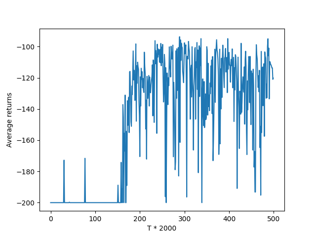
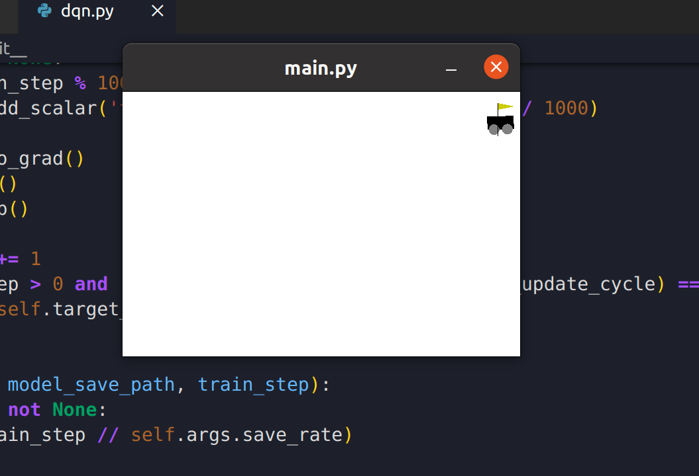

# 《机器学习》大作业——强化学习

## 分工

| 组员姓名 | 工作内容 |
| -------- | -------- |
| 林浩然   | 编写代码 |
| 孙立帆   | 编写代码 |
| 徐王子   | 撰写报告 |

## 环境安装

### OpenAI Gym 环境的安装

通过 pip 来安装 OpenAI 的 Gym 环境，需要注意的是安装的版本应该是 0.1, 而不是新的 0.2 版本，否则会由于新版本的 API 变动带来一些接口变更导致代码无法运行的问题。 

### 其他环境配置(非重要部分省略)

torch==2.0.1

pyglet==1.5.27

## 任务环境

我们参考了 OpenAI Gym 的官方文档中对于 Mountain Car 环境的介绍，可以从这个任务的状态，动作，回报函数设计来刻画这个环境:

### 状态空间

Mountain car 任务中的状态是两维的，具体来说在 gym 的实现中是一个大小为 (2, ) 的 numpy array, 两维分别表示小车在 x  轴上的坐标以及小车的速度。

### 动作空间

动作空间是一个大小为 3 的离散空间, 分别是:

0. 向左加速
1. 不加速
2. 向右加速

### 状态转移

用 $pos_t, v_t$ 表示第 $t$ 个时间步的时候小车的位置和速度，小车的状态转移可以由以下动力学方程描述:
$$
v_{t+1} = v_t + (action - 1) * f - cos(3*pos_t) * g \\
pos_{t + 1} = pos_t + v_{t + 1}
$$
其中 $f = 0.001, g = 0.0025$

### 奖励函数

任务的目标是到达山顶，奖励为负数，在每个时间步都会作出一个 -1 的惩罚

### 理解和思考

Mountain Car 环境是 OpenAI Gym 中的一种强化学习环境，目标是让一个小车从山谷底部到山顶。这个任务相对简单，但是需要克服的难度在于小车的引擎功率不足，无法直接从低谷爬到高峰，必须先向另一侧移动，获得足够的动能再返回低谷，通过反复振荡来逐渐爬升。这个任务具有连续的状态和离散的动作空间，并且奖励信号非常稀疏，因此这个环境是一个典型的强化学习控制任务,需要通过大量的探索和学习来解决。

## DQN

### DQN 算法伪代码

```pseudocode
初始化:       
Q_network : 评估网络,用于计算状态-动作值函数    
target_Q_network: 目标网络,定期从Q_network复制参数    
replay_buffer: 经验回放池,存储状态转移      
batch_size: 随机采样小批量大小      
gamma: 衰减系数,折扣未来奖励     
learning_rate: Q_network的学习率  

开始训练:  
1. 初始化环境,获得初始状态state    

2. 根据state查询Q_network获得所有Q值,使用 epsilon-greedy 策略选择 action.  

3. 执行action,获得奖励reward和新状态new_state     

4. 存储转移(state, action, reward, new_state)到经验回放池replay_buffer    

5. 从replay_buffer随机抽取小批量batch_size个转移    

6. 计算这些转移的Q值:Q_target = reward + gamma * max_a(target_Q_network(new_state, a))   

7. 计算这些转移的预测Q值:Q_predict = Q_network(state, action)    

8. 计算Q_network的损失:loss = (Q_target - Q_predict) ^ 2    

9. 梯度下降,更新Q_network参数,降低loss     

10. 每隔一段时间,替换target_Q_network的参数为Q_network的参数    

11. 重复步骤2-10,不断训练,直到达到最大回合数       
```


### 代码补全方案

#### epsilon-greedy policy

```python
def select_action(self, states, epsilon):
    # TODO: 补全epsilon_greedy代码实现
    if np.random.uniform() < epsilon:
        action = np.random.choice(np.arange(self.args.n_actions))
    else:
        inputs = torch.tensor(states, dtype=torch.float32).unsqueeze(0)
        if self.args.cuda:
            inputs = inputs.cuda()
        q_value = self.policy.q_network(inputs).detach()
        action = torch.argmax(q_value)
        action = action.cpu().numpy()
    return action.copy()
```

当 sample 到小于 epsilon 的时候，就等概率地随机选择一个动作，否则选择 q 值最大的动作。epsilon greedy policy 体现了强化学习中 exploration 和 exploitation 的平衡。

#### target-q calculation

```python
        # calculate the target Q value function
        with torch.no_grad():
            q_next_all = self.target_q_network(next_states)
            q_next = torch.max(q_next_all, dim=1, keepdim=True)[0]
            # TODO: 补全target_q的计算相关代码实现
            target_q = (rewards.unsqueeze(1) + self.args.gamma * q_next * done_multiplier).detach()
```

根据公式: $y = r_{t + 1} + \gamma max_{a_{t+1}} \overline{Q}(s_{t+1}, a_{t+1};\theta^-) * (1 - done)$ 计算 target_q


### 理解和思考

DQN 代码实现的核心是 DQN 算法，这个算法的基本思想是使用深度神经网络来逼近 Q 值函数。具体来说，算法通过不断更新神经网络参数，使得网络的 Q 值函数逼近最优的 Q 值函数，从而可以实现智能体在 Mountain Car 环境下的控制。DQN 代码中的重点在于神经网络的实现和训练，其中包括输入状态和输出动作的处理、目标 Q 值的计算、误差的计算和反向传播等步骤。

## 实验结果

### 实验参数设置

为了取得示例中的效果，我们修改了默认的实验参数配置，修改的部分如下:

1. epsilon: 0.8
2. epsilon_min: 0.01
3. epsilon_anneal_time: 500000
4. buffer_size: 10000
5. max_episodes: 10000

这些参数修改的方向都是使得训练过程更长和精细，以取得更好的效果。

### 实验结果展示

#### 训练过程中的 average returns



#### 演示结果



演示视频见同文件夹下的视频文件

### 理解和思考

本实验中，Mountain Car 环境和 DQN 代码相辅相成。通过使用 DQN 代码，我们训练了一个 DQN 智能体，使其在 Mountain Car 环境中学习并表现出优秀的控制能力。同时，DQN 代码会将智能体的状态、动作和奖励等信息传递给 Mountain Car 环境，然后根据环境的反馈进行训练，直到智能体能够学会在 Mountain Car 环境中达到目标位置为止。二者共同构成了一个强化学习的系统，实现了从环境到智能体的信息传递和学习过程。

Mountain Car 环境和 DQN 代码在强化学习中是举足轻重的。通过学习这些内容，可以更好地理解强化学习的基本思想和方法，并且可以掌握如何使用神经网络来逼近 Q 值函数，解决高维状态和连续动作空间等问题。

## 参考资料来源

[1] [ Mountain Car - Gym Documentation](https://www.gymlibrary.dev/environments/classic_control/mountain_car/)

[2] [RL — DQN Deep Q-network](https://jonathan-hui.medium.com/rl-dqn-deep-q-network-e207751f7ae4)